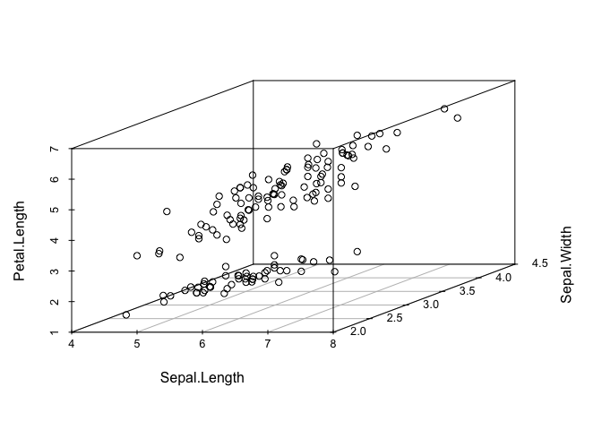
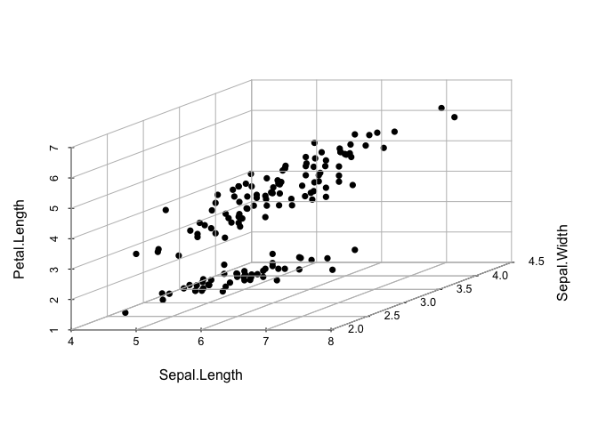

<!-- README.md is generated from README.Rmd. Please edit that file -->
graph3d Customize 3D graphs in R
================================

Installation
------------

``` r
if(!require(devtools)) install.packages("devtools")
devtools::install_github("kassambara/graph3d")
```

Geting started
--------------

### Add grids to a scatterplot3d

The function **s3d\_addgrids()** can be used as follow:

``` r
library("scatterplot3d")

data(iris)

# Basic 3d graphics
scatterplot3d(iris[,1:3])
```



``` r
# Remove box and add grids
scatterplot3d(iris[, 1:3], pch = 16, grid = TRUE, box = FALSE)
s3d_addgrids(iris[, 1:3], grid = c("xy", "xz", "yz"))
```


