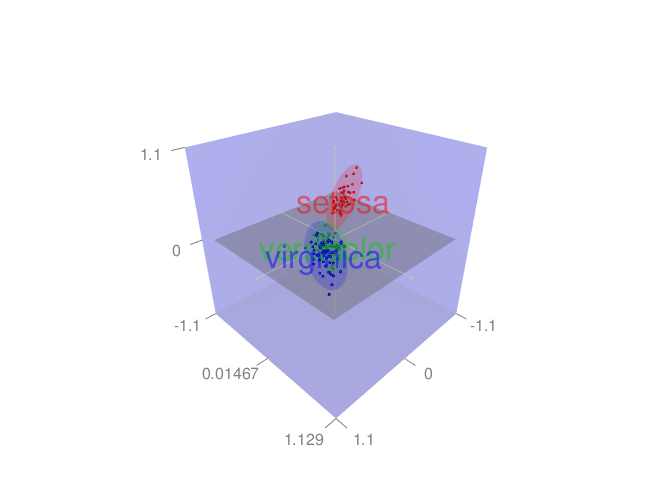
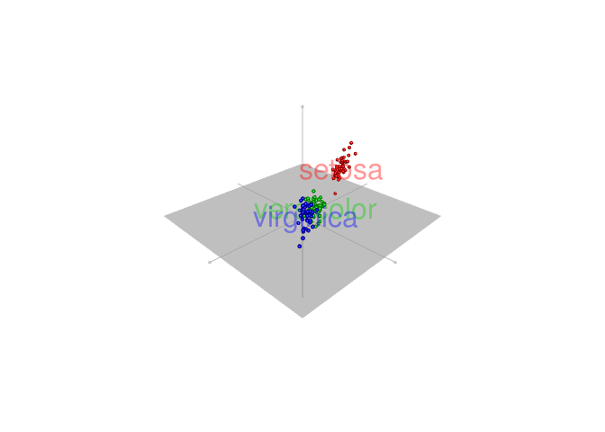
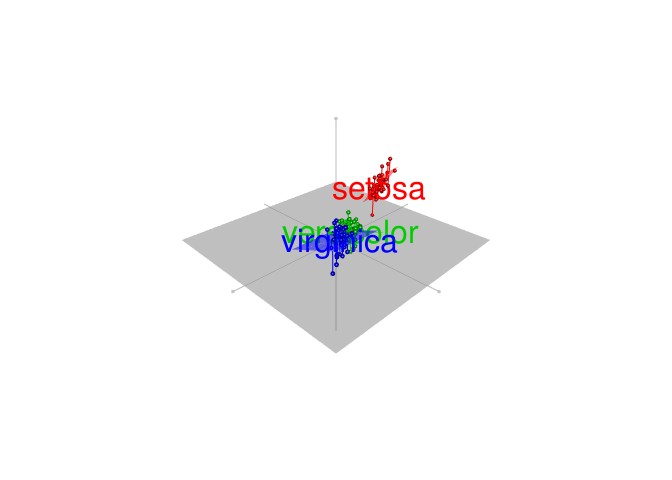
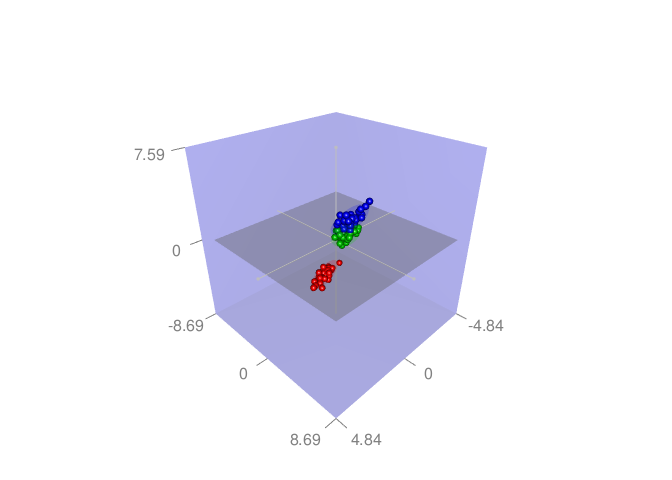
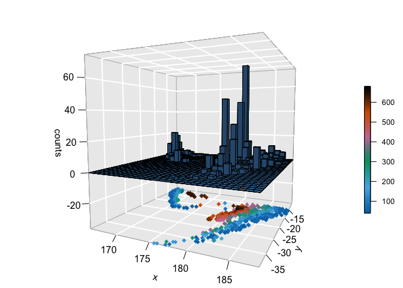
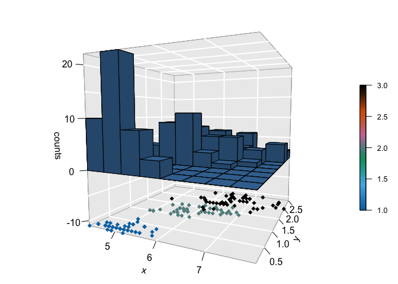

<!-- README.md is generated from README.Rmd. Please edit that file -->
graph3d Customize 3D graphs in R
================================

Installation
------------

``` r
if(!require(devtools)) install.packages("devtools")
devtools::install_github("kassambara/graph3d")
```

Geting started
--------------

### Quick RGL scater plot

``` r
require(rgl)
#> Loading required package: rgl
data(iris)
x <- iris$Sepal.Length
y <- iris$Petal.Length
z <- iris$Sepal.Width
```

``` r
rgl_scatter(iris, groups = iris$Species, add.ellipse = TRUE,
            data.scale = TRUE)
```



Remove the bounding box:

``` r
rgl_scatter(iris, groups = iris$Species, show.bbox = FALSE)
```



Add regression planes

``` r
rgl_scatter(iris, groups = iris$Species, show.bbox = FALSE, add.reg.planes = TRUE)
```



### Build customized RGL plots

``` r
rgl_init()
rgl.spheres(x, y, z, r = 0.2, color = get_colors(iris$Species))
rgl_add_axes(x, y, z, show.bbox = TRUE)
rgl_add_ellipses(x, y, z, groups = iris$Species)
aspect3d(1,1,1)
```



### Add grids to a scatterplot3d

The function **s3d\_addgrids()** can be used as follow:

``` r
library("scatterplot3d")

data(iris)

# Basic 3d graphics
scatterplot3d(iris[,1:3])
```


``` r
# Remove box and add grids
scatterplot3d(iris[, 1:3], pch = 16, grid = TRUE, box = FALSE)
s3d_addgrids(iris[, 1:3], grid = c("xy", "xz", "yz"))
```


### 3D histogram distribution

``` r
# quakes dataset
data("quakes")
dist3d(quakes$long, quakes$lat, colvar=quakes$depth,
             breaks = 30, col.bar = "steelblue")
```



``` r
# Iris dataset
dist3d(iris$Sepal.Length, iris$Petal.Width, col.bar = "steelblue", 
             colvar=as.numeric(iris$Species))
```


